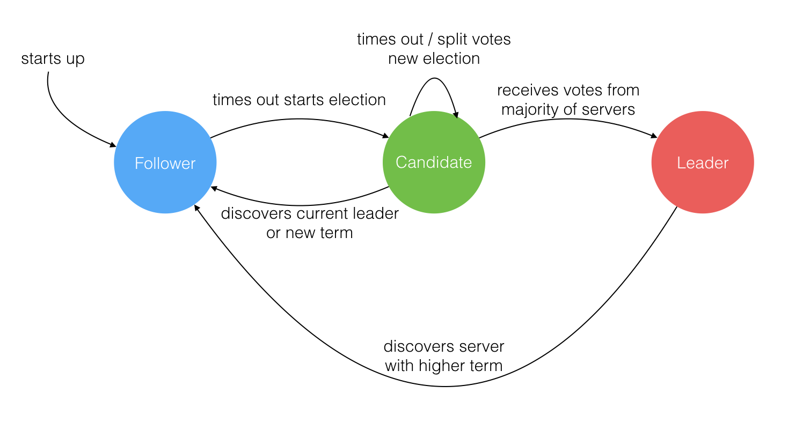

# 大数据基础之Raft协议初探

## 前言

在看<大数据日志录>第二章关于一致性协议的内容时, 对Paxos和Raft产生了好奇。但是Paxos一时没有弄懂而Raft相对容易理解点, 所以本文先简单介绍下Raft。

看完有关Raft的资料后打算按自己理解的简单来描述这个协议以加深印象.

## 基本概念

Raft有三个角色:

* Leader(领导)
* Follower(群众)
* Candidate(候选者)

可以用以下例子来描述:

* 就像一个民主社会，领袖由民众投票选出。刚开始没有领袖，所有集群中的参与者都是群众，那么首先开启一轮大选，在大选期间所有群众都能参与竞选，这时所有群众的角色就变成了候选人，民主投票选出领袖后就开始了这届领袖的任期，然后选举结束 ，所有除领袖的候选人又变回群众角色服从领袖领导。
* 每个领导都有一个任期，用术语Term 表达。一旦领导发生变化, Term就会随着递增。每一个term只有一个leader。

## 选举

可以用以下图来描述整个选举过程:

1.  Leader会定期向Follower发送心跳消息来巩固自己的领导地位。这是单向的消息发送规则, Follower只有接受的份儿.
2.  如果某一刻Follower没有收到来自Leader的心跳消息, 那么他们会认为Leader已经不在了。这时会有TimeOut限制, 每个Follower各自会产生一个随机的等待时间, 最短的1个或多个Follower一旦结束等待就会自动成为Candidate, 并向其他的Follower发出投票请求, 这个时候已进入新的任期Term 2。
3.  每一个节点无论Follower或者Candidate, 只要没成为Leader就必须对收到的投票请求进行投票, 且只能投票一次。Candidate投的是自己。
4.  对于每一个Candidate接下来会有三种情况:
       1.   如果Candidate获取到多数相同term的投票，则被选举成为leader
       2.   如果Candidate接受到另外的节点宣称他已成为leader。 如果该leader的term大于等于Candidate的term, 则Candidate承认他为leader并将自己转为follower, 否则拒绝承认他为leader而继续保持Candidate。
       3.   如果同一时刻存在多个Candidate，从而导致投票分流，所有的Candidate没有得到多数的投票。那么这个时候所有Candidate会进入新的任期Term3, 所有的Follower和Candidate再次产生随机的等待时间进行竞争, 重现进行
       选举。
6. 一旦Leader产生, 那么Leader会发送心跳给所有其他节点, Candidate会强制转换成为Follower, 所有的Follower开始新的的Term并进入新的等待时间。

引用中的的[Raft动画](http://thesecretlivesofdata.com/raft/)很详细生动的描述了整个过程。

再次强调整个过程中几个重要点:

* 由于选举机制的存在, 节点不能少于3个
* 记住两个time， 一个是election timeout, 即Follower发现leader不在了或者发生竞争时所有节点产生的随机时间, 他大大降低了分流选票出现的概率。 另一个是heartheat timeout, 一旦该time内没接受到leader的心跳则认为leader不在了。
* follower转换成Candidate, 新的任期term开始。

## 日志复制

Raft 协议强依赖 Leader 节点的可用性来确保集群数据的一致性。数据的流向只能从 Leader 节点向 Follower 节点转移。当 Client 向集群 Leader 节点提交数据后，Leader 节点接收到的数据处于未提交状态（Uncommitted），接着 Leader 节点会并发向所有 Follower 节点复制数据并等待接收响应，确保至少集群中超过半数节点已接收到数据后再向 Client 确认数据已接收。一旦向 Client 发出数据接收 Ack 响应后，表明此时数据状态进入已提交（Committed），Leader 节点再向 Follower 节点发通知告知该数据状态已提交。

## 容灾

接下来我们来分析几种情况:

#### 1.数据还为达到leader, leader挂了

由于leader没接受到消息, 客户端接受到commit超时。

#### 2.数据达到leader, 未复制到follower, leader挂了

此时数据属于未提交状态，Client 不会收到 Ack 会认为超时失败可安全发起重试。Follower 节点上没有该数据，重新选主后 Client 重试重新提交可成功。原来的 Leader 节点恢复后作为 Follower 加入集群重新从当前任期的新 Leader 处同步数据，强制保持和 Leader 数据一致。

#### 3.数据达到leader, 已复制到所有follower, 但未响应leader，leader挂了

此时数据属于未提交状态，Client 不会收到 Ack 会认为超时失败可安全发起重试。但是由于数据已经复制到follower上了, 且cilent由于超时发送失败会再次发送相同数据, 这个时候就会出现数据重复。 所以要求raft实现client幂等性和内部去重机制。(这算是raft的缺陷)

#### 4.数据达到leader, 已复制到部分follower, 但未响应leader，leader挂了
跟上面的情况相似，但是由于数据的版本不一致，所以raft会要求数据版本低向数据版本高的投票，所以数据版本高的会选为leader, 并强制同步数据. 同样要求raft实现幂等性和内部去重机制。

#### 数据达到leader, leader已经提交数据而follower未提交，leader挂了
同第3点

#### 数据达到leader, leader和follower已提交，leader还未响应client, leader挂了
同第3点

所以raft的容灾是有缺陷的，需要外部保证client幂等性和数据节点内部去重机制

#### 脑裂

网络分区将原先的 Leader 节点和 Follower 节点分隔开，Follower 收不到 Leader 的心跳将发起选举产生新的 Leader。这时就产生了双 Leader，原先的 Leader 独自在一个区，向它提交数据不可能复制到多数节点所以永远提交不成功。向新的 Leader 提交数据可以提交成功，网络恢复后旧的 Leader 发现集群中有更新任期（Term）的新 Leader 则自动降级为 Follower 并从新 Leader 处同步数据达成集群数据一致。

## 总结

通过前文的简单介绍不难理解raft算法， 这就是他的一个特点可理解的。 后续在容灾过程中发现， raft算法并不能彻底独立解决一致性问题，需要client重复重发的幂等性和节点自身的内部去重机制保证， 所以还有待完善的地方。

## 引用

本文的内容主要参考以下:

[<Raft为什么是更易理解的分布式一致性算法>](http://blog.csdn.net/mindfloating/article/details/50774564)

[<Raft动画(超赞)>](http://thesecretlivesofdata.com/raft/)

<大数据日志录>
