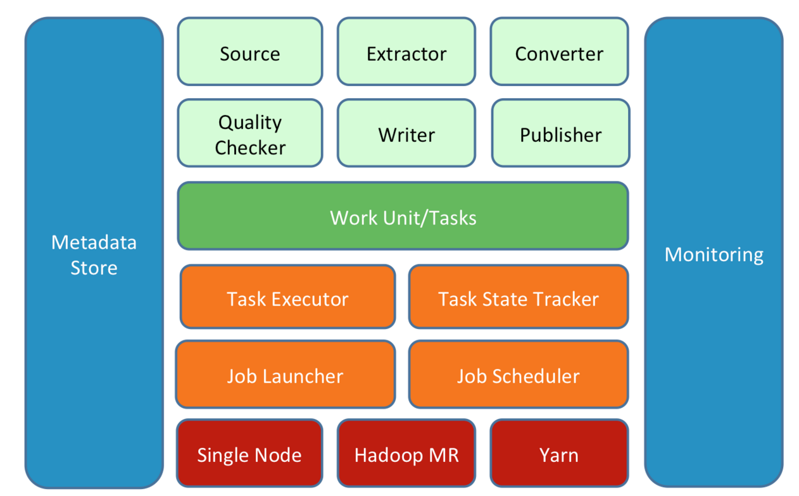
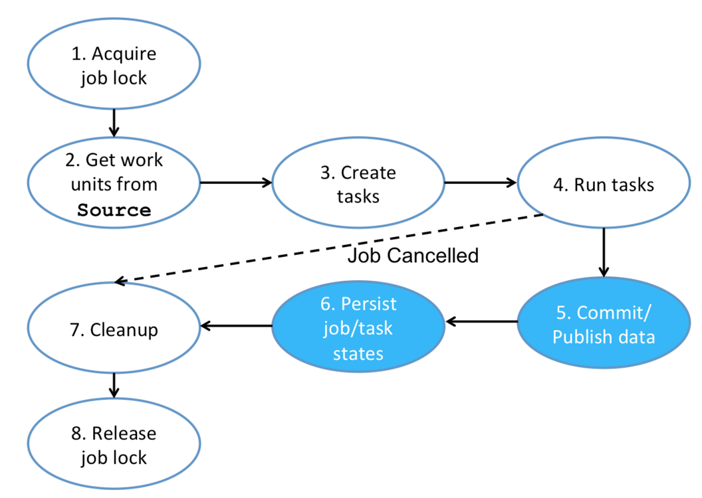
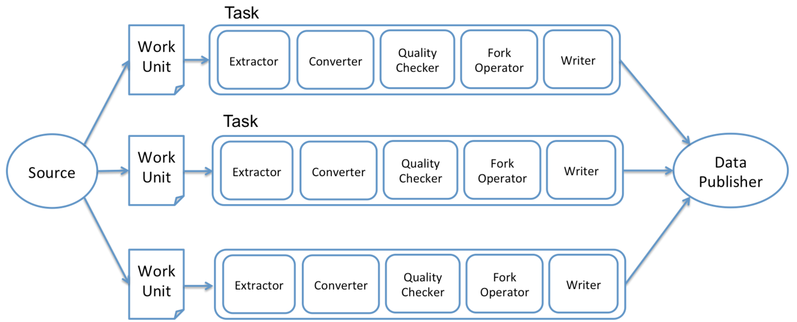
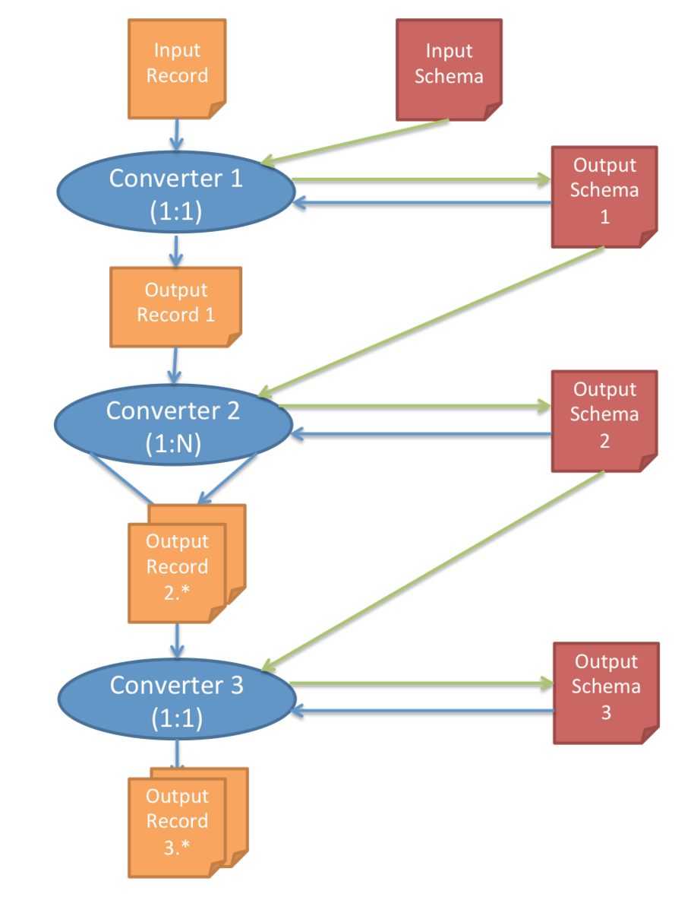

# Gobblin系列一之初探

由于需要从kafka批量把日志dump到hdfs上，所以我们使用了linkin的Gobblin工具。Gobblin目前还处于开发阶段，资料比较少，文档介绍的也不是很详细，要使用他只能去阅读源码。因此我打算通过一系列的Gobblin的文章来记录下我的学习使用心得。

本文主要初步介绍Gobblin的基础框架, 主要内容来自[<官方文档>](https://github.com/linkedin/gobblin/wiki/Gobblin-Architecture)
, 然后在后续文章中展开介绍。

本人使用的Gobblin版本是0.6.2

## 简介

Gobblin是由linkin开源的Hadoop通用数据摄取框架，可以从各种数据源中提取，转换和加载海量数据。比如：数据库，rest APIs，kafka，等等。Gobblin 处理日常规划任务需要所有数据摄取ETLs，包括作业/任务规划，任务分配，错误处理，状态管理，数据质量检测，数据发布等等。

Gobblin 通过同样的执行框架从不同数据源摄取数据，在同一个地方管理所有不同数据源的元数据。同时结合了其他特性，比如自动伸缩，容错，数据质量保证，可扩展和处理数据模型改革等等。Gobblin 变得更容易使用，是个高效的数据摄取框架。

那么Gobblin与Sqoop有啥区别？

* Gobblin可以接入各种数据源, 而Sqoop只能对接关系型数据库。
* Gobblin只管摄入, 也就是说Gobblin只能实现数据源摄入到hdfs上, 而不能实现hdfs导出其他数据源上。相反, Sqoop实现了关系型数据库跟hadoop之间的互导.
* Gobblin支持一定的ETL,容错,数据监测等功能, 而Sqoop支持的有限的etl功能是在数据库上(sql)实现的。

因此Gobblin并不能取代Sqoop, 两者是一种互补。

## 框架

Gobblin一开始设计就把可扩展性考虑了进去，因此开发者只要开发相应的adapter或者使用已有的adapter就可以实现相应的功能。

* Gobblin由一系列负责不同功能的task和workunit组成(绿色部分)。在Gobblin中task分为Source,Extractor,Converter,QualityChecker,Writer,Publisher这几种组成(浅绿色部分),在下文的任务流模块中将更详细介绍, 对应gobblin-core package
* Gobblin的任务运行在Gobblin Runtime内核中(橘黄色部分),它负责job/task调度, 运行失败处理, 状态管理, 资源申请, 数据质量检测等, 对应gobblin-runtime package
* Gobblin可以有两种实现方式(红色部分), 1.单机, 2.MapReduce, 当然也支持yarn的资源管理。
* 最后蓝色部分就是元数据管理,任务监控。

## 工作流

一个Gobblin Job即是一次完整的数据摄取过程.

1. job开始时候首先会设置job lock, 防止后续的job在前一个未完成的情况下启动，比如设置了Azkaban负责调度, 就会有定时启动设置.
2. Gobblin 会根据配置文件创建Source。 Source主要实现两个功能: 1. 将摄取任务分成多个workunit, 每一个workunit都对应一部分数据; 2. Source还负责为每一个workunit创建Extractor, Extractor才是真正进行数据摄取的步骤。该设计同MapReduce的inputformat，inputformat负责数据的切分以及RecordReader创建, 而RecordReader才是进行数据读取的部件。
3. Gobblin会根据source创建的workunit来创建对应的一系列task, 由此可见task就是运行时态的workunit。一般情况下 task与workunit是一对一的关系，但是也存在特殊情况MultiWorkUnit, 实现多对多的映射。
4. 接下来就是运行task. 单机模式下, task运行在一个线程池内，而mapreduce模式下则运行在hadoop集群上。
5. 当task运行完以后job会根据配置来决定是否publish数据，如果设置了JobCommitPolicy.COMMIT_ON_PARTIAL_SUCCESS 则只要部分task成功运行就可以publish数据，而JobCommitPolicy.COMMIT_ON_FULL_SUCCESS则需要所有task运行成功。
6. 当数据publish后，job会储存job/task的status。这样下一个job启动时候就可以读取这些数据比如watermarks而知道从哪里开始运行。
7. 删除执行过程中产生的中间数据。
8. 最后释放掉job lock, 以便下一个job运行。

## 任务组成

在工作流小节中简要介绍job的流程, 那么本节将介绍task的组成:Source, Extractor, Converter, QualityChecker,  ForkOperator, Writer, Publisher.

### Source and Extractor

前文讲到Source主要负责将数据切分成多个workunits以及为每一个workunit创建Extractor, 而Extractor则负责进行数据的摄取与解析。

Source支持各种数据源, jdbc支持的数据库, kafka, FTP/SFTP, Rest APIs等. 目前Extractor只支持以单个record颗粒度的数据摄取以及解析, 也就是说在Extractor阶段同一时间只能处理单条record。

### Converter

Converter 负责将一个record转换成另一个record, 因此对于一个Converter它需要输入的record schema和输出的record schema作为参数。

Converter 还支持级连，也就是说可以多个Converter 组成一个链式处理, 每一个Converter负责某一个转换。

上图就是一个Converter Chain链式操作, 它支持1:1,1:N映射。

### Quality Checker

Quality Checker 负责对数据进行质量验证, 有两种类型:

1. 对每一条record进行验证以决定是否可以进行任务流的下个步骤, 因此也称为row-level QualityChecker;
2. 对全部的任务流的最终输出进行验证以决定是否提交数据, 因此也称为task-level QualityChecker。

Quality Checker 分为MANDATORY和OPTIONAL，前者为强制类型，即需要满足所有的MANDATORY Checker都验证通过才会最后提交，后者只会输出提示信息。Quality Checker 也可多个组成链式。

### Fork Operator

Fork Operator 是控制任务流分支, 比如需要对同一份数据输出到不同的目录下, 就可以通过Fork来实现。

### Data Writer

DataWriter 顾名思义就是将record写到指定的地方，如hdfs上。 Gobblin 默认提供了AvroHdfsDataWriter类将数据以avro的格式写入到hdfs上。 DataWriter 是插件形式的, 开发者可以自己定制DataWriter，通过继承DataWriter和DataWriterBuilder, 并在配置文件里进行指定。

### Data Publisher

DataPublisher 将DataWriter生成的目录移动到最后的目录。

## 任务流

上一节介绍了 Gobblin的由哪些任务组成, 本节通过一个完整的例子来介绍完成的一个任务流.

* 一个Gobblin由一个main branch和多个forked branch组成, forked branch需要在配置中额外添加。如果没有forked branch， 则Gobblin 会使用IdentityForkOperator来创建单个分支。 IdentityForkOperator由一个main branch和单个forked branch组成。
* 需要注意的是, 每一个forked branch的输入数据是完全一样的, 所以每个branch都是Copyable的一个实例，即数据是复制的。
* 如果在每个branch中加入了task-level QualityChecker, 那么每个branch必须等检验通过了才会提交数据。
* 最后所有branch都成功了才算job成功, 在task运行过程中会有TaskStateTracker保持task status, task metrics等数据。

## 状态管理

Gobblin可以周期的运行job, 并根据已经存在的上一个周期的数据实现增量运行, 比如根据上一个job周期存下来的数据获取新增的或者改变的数据。

默认情况下, Gobblin会在hdfs上为每一个job建立不同的目录，并存放序列化后的数据。

## 失败处理

Gobblin支持失败的job重试多次，发送email，

## 工作调度

单机模式下，Gobblin默认使用Quartz scheduler, 它可以跟 Azkaban,Oozie, Crontab这些scheduler一起部署， 甚至多个联合部署。

## 总结

本文主要简单介绍了Gobblin的基本概念以及框架, 通过本文可以整体上了解Gobblin是怎么工作的，有什么明显的特点。那么接下来的文章将详细展开介绍每一部分。

本文完。
