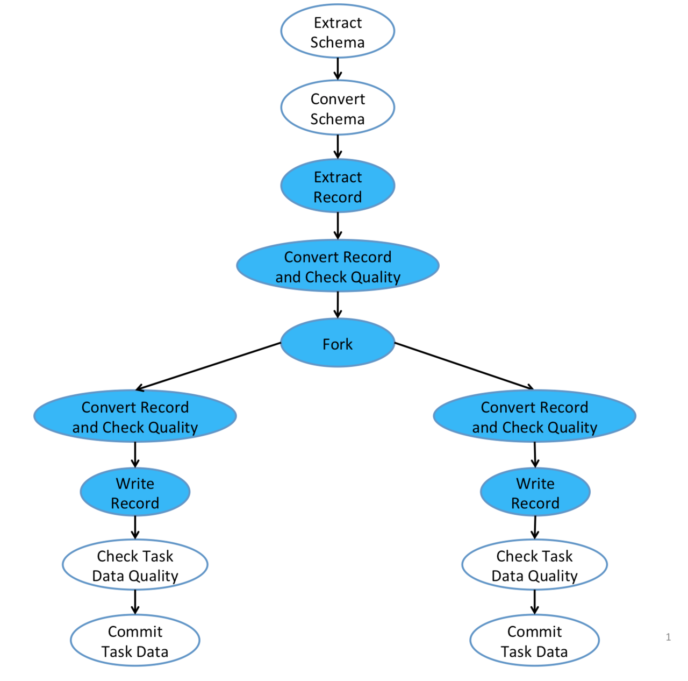
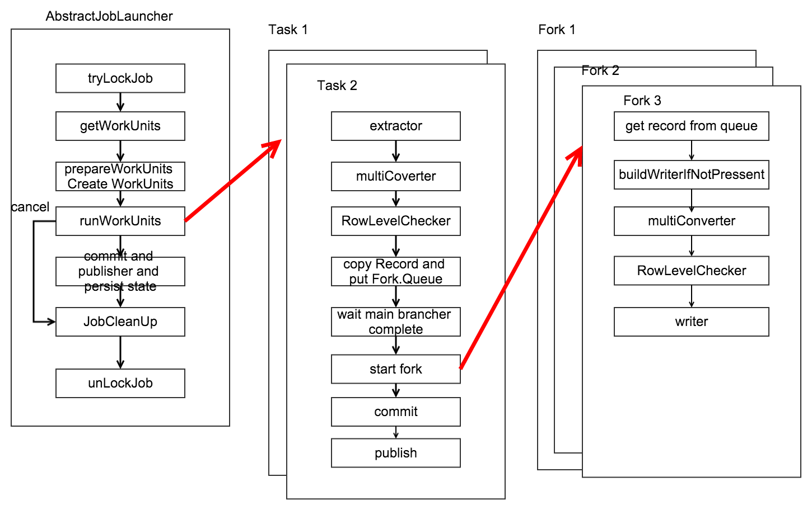

## 简介

Gobblin有两个重要的包即Gobblin-core和Gobblin-runtime, 前者实现了丰富的模块组件, 后者实现了完整的运行机制, 如此构成了Gobblin的高可扩展性的特点。

作为Gobblin的内核, Gobblin-runtime实现了Gobblin的工作流程和任务流程。本文名为Runtime初探, 主要研究目的就是通过Gobblin-runtime来了解Gobblin的运行逻辑, 便于后续对Gobblin的灵活开发。

在前文[《Gobblin系列一之初探》](http://lamborryan.github.io/gobblin-first-exploration/)中提到了Gobblin具有工作流和任务流的概念。那么本文就分为工作流和任务流两块来介绍。

## 工作流

所谓工作流就是指gobblin job从启动开始到结束这一个生命周期的工作流程。 这里引用[《Gobblin系列一之初探》](http://lamborryan.github.io/gobblin-first-exploration/) 的图示.


那么本节主要通过代码阅读来加深这一幅图。 工作流的代码主要集中在AbstractJobLauncher这个虚类中。它定义了启动和运行job的框架，它有两个子类为LocalJobLauncher和MRJobLauncher, 分别对应stanalone和mapreduce这两个运行模式。

工作流主要逻辑都在launchJob方法内

``` java
    public void launchJob(JobListener jobListener) throws JobException {

        // *** 省略代码

        // 获取job锁
        if (!tryLockJob()) {
            this.eventSubmitter.submit(gobblin.metrics.event.EventNames.LOCK_IN_USE);
            throw new JobException(String.format(
              "Previous instance of job %s is still running, skipping this scheduled run", this.jobContext.getJobName()));
        }
        // *** 省略代码

        // 根据配置文件内设置的Source获取WorkUnits, 这里注意source的getWorkunits方法
        TimingEvent workUnitsCreationTimer =
          this.eventSubmitter.getTimingEvent(TimingEventNames.LauncherTimings.WORK_UNITS_CREATION);
        // Generate work units of the job from the source
        Optional<List<WorkUnit>> workUnits = Optional.fromNullable(this.jobContext.getSource().getWorkunits(jobState));
        workUnitsCreationTimer.stop();

        // *** 省略代码

        // 创建tasks
        TimingEvent workUnitsPreparationTimer =
            this.eventSubmitter.getTimingEvent(TimingEventNames.LauncherTimings.WORK_UNITS_PREPARATION);
        prepareWorkUnits(JobLauncherUtils.flattenWorkUnits(workUnits.get()), jobState);
        workUnitsPreparationTimer.stop();

        // *** 省略代码

        // 运行task
        TimingEvent jobRunTimer =           this.eventSubmitter.getTimingEvent(TimingEventNames.LauncherTimings.JOB_RUN);
        // Start the job and wait for it to finish
        runWorkUnits(workUnits.get());
        jobRunTimer.stop();

        // 如果取消了job则跳过后续的commit/publish 以及persist
        if (jobState.getState() == JobState.RunningState.CANCELLED) {
          LOG.info(String.format("Job %s has been cancelled, aborting now", jobId));
          return;
        }

        // *** 省略代码

        // 进行commit和publisher以及persist过程, 其中commit调用了JobContext的commit方法
        TimingEvent jobCommitTimer =            this.eventSubmitter.getTimingEvent(TimingEventNames.LauncherTimings.JOB_COMMIT);
        this.jobContext.finalizeJobStateBeforeCommit();
        this.jobContext.commit();
        postProcessJobState(jobState);
        jobCommitTimer.stop();

        // *** 省略代码
        // clean up
        cleanupStagingData(jobState);
        // 释放job锁
        unlockJob();

}
```

以上就是gobblin的工作流的各阶段, 从设计上看, commit/publiser 和 persist与task任务的运行彻底分开来了。task只负责数据的转换, 不管数据的落地。

#### commit/publiser 和 persist

commit/publiser 和 persist是在JobContext的commit方法内实现的。

``` java
void commit() throws IOException {  

    // *** 省略代码
    commitDataset(datasetState, closer.register(DataPublisher.getInstance(dataPublisherClass, datasetState)));

    // *** 省略代码

    persistDatasetState(datasetUrn, datasetState);
}

/**
 * Commit the output data of a dataset.
 */
@SuppressWarnings("unchecked")
private void commitDataset(JobState.DatasetState datasetState, DataPublisher publisher) throws IOException {

  try {
    publisher.publish(datasetState.getTaskStates());
  } catch (Throwable t) {
    LOG.error("Failed to commit dataset", t);
    setTaskFailureException(datasetState.getTaskStates(), t);
  }

  // Set the dataset state to COMMITTED upon successful commit
  datasetState.setState(JobState.RunningState.COMMITTED);
}

/**
 * Persist dataset state of a given dataset identified by the dataset URN.
 */
private void persistDatasetState(String datasetUrn, JobState.DatasetState datasetState) throws IOException {
  LOG.info("Persisting dataset state for dataset " + datasetUrn);
  this.datasetStateStore.persistDatasetState(datasetUrn, datasetState);
}
```

当然commit不会这么简单, Gobblin内有个publish策略,

* The JobCommitPolicy.COMMIT_ON_PARTIAL_SUCCESS policy 只要部分task成功.
* The JobCommitPolicy.COMMIT_SUCCESSFUL_TASKS policy .
* The JobCommitPolicy.COMMIT_ON_FULL_SUCCESS policy 所有task都成功.

需要满足以下条件才能进行commit

``` java
private boolean canCommitDataset(JobState.DatasetState datasetState) {
  // Only commit a dataset if 1) COMMIT_ON_PARTIAL_SUCCESS is used, or 2)
  // COMMIT_ON_FULL_SUCCESS is used and all of the tasks of the dataset have succeeded.
  return this.jobCommitPolicy == JobCommitPolicy.COMMIT_ON_PARTIAL_SUCCESS
      || this.jobCommitPolicy == JobCommitPolicy.COMMIT_SUCCESSFUL_TASKS
      || (this.jobCommitPolicy == JobCommitPolicy.COMMIT_ON_FULL_SUCCESS
          && datasetState.getState() == JobState.RunningState.SUCCESSFUL);
}
```

至此已经简要介绍了Gobblin的工作流的源码。那么下一节将重点介绍Gobblin的任务流。

## 任务流

同样引用[《Gobblin系列一之初探》](http://lamborryan.github.io/gobblin-first-exploration/)中关于任务流的图示



我们先从上节的runWorkUnits(workUnits.get())method开始讲起。

``` java
public static List<Task> runWorkUnits(String jobId, List<WorkUnit> workUnits, TaskStateTracker stateTracker,
    TaskExecutor taskExecutor, CountDownLatch countDownLatch) {

  List<Task> tasks = Lists.newArrayList();
  for (WorkUnit workUnit : workUnits) {
    String taskId = workUnit.getProp(ConfigurationKeys.TASK_ID_KEY);
    WorkUnitState workUnitState = new WorkUnitState(workUnit);
    workUnitState.setId(taskId);
    workUnitState.setProp(ConfigurationKeys.JOB_ID_KEY, jobId);
    workUnitState.setProp(ConfigurationKeys.TASK_ID_KEY, taskId);

    // Create a new task from the work unit and submit the task to run
    Task task = new Task(new TaskContext(workUnitState), stateTracker, taskExecutor, Optional.of(countDownLatch));
    stateTracker.registerNewTask(task);
    tasks.add(task);
    taskExecutor.execute(task);
  }

  new EventSubmitter.Builder(JobMetrics.get(jobId).getMetricContext(), "gobblin.runtime").build()
      .submit(EventNames.TASKS_SUBMITTED, "tasksCount", Integer.toString(workUnits.size()));

  return tasks;
}
```

Gobblin为每一个workunit启动了一个task，由此可见任务流运行在Task类中, 且主要逻辑在Task的run方法内。而跟任务流逻辑有关的又分为两个类即Task类和Fork类。Task相当于主线程, Fork相当于分支线程.

#### Task逻辑

``` java
public void run() {
    // *** 省略代码

    // 根据source的getExtractor获取每个workunit对应的extractor
    extractor =
        closer.register(new InstrumentedExtractorDecorator(this.taskState, this.taskContext.getExtractor()));

    // 根据配置, 获取1个或者多个级连起来的converter
    converter = closer.register(new MultiConverter(this.taskContext.getConverters()));

    // 根据配置获取其他分支fork, 如果只有一个分支就为IdentityForkOperator
    // Get the fork operator. By default IdentityForkOperator is used with a single branch.
     ForkOperator forkOperator = closer.register(this.taskContext.getForkOperator());

    // *** 省略代码
    // 以一个record为最小单位处理数据, 首先经过MultiConverter的convertRecord, 然后进入processRecord过程
    while ((record = extractor.readRecord(null)) != null) {
        recordsPulled++;
        for (Object convertedRecord : converter.convertRecord(schema, record, this.taskState)) {
            processRecord(convertedRecord, forkOperator, rowChecker, rowResults, branches);
        }
    ｝

    // fork会等待main branch的任务完成
    for (Optional<Fork> fork : this.forks) {
      if (fork.isPresent()) {
        // Tell the fork that the main branch is completed and no new incoming data records should be expected
        fork.get().markParentTaskDone();
      }
    }

    // 开始每一个fork 并行进行处理
    for (Optional<Fork> fork : this.forks) {
      if (fork.isPresent()) {
        try {
          this.forkCompletionService.take();
        } catch (InterruptedException ie) {
          Thread.currentThread().interrupt();
        }
      }
    }

    // 这里进行task level checker, 并进行commit
    // Check if all forks succeeded
      boolean allForksSucceeded = true;
      for (Optional<Fork> fork : this.forks) {
        if (fork.isPresent()) {
          if (fork.get().isSucceeded()) {
            if (!fork.get().commit()) {
              allForksSucceeded = false;
            }
          } else {
            allForksSucceeded = false;
          }
        }
      }

    // pulisher data。
    if (shouldPublishDataInTask()) {
      // If data should be published by the task, publish the data and set the task state to COMMITTED.
      // Task data can only be published after all forks have been closed by closer.close().
      publishTaskData();
      this.taskState.setWorkingState(WorkUnitState.WorkingState.COMMITTED);
    }
}

```

> 咦, 怎么在task里面也要进行publish？这是因为pulisher分为task-level和job－level。 上一节介绍的是job－leverl, 而本节讲到的是task-level. 如果设置了job-level publish那么这里就不会publish了。 两者的主要区别在于一个粗细精度的问题。

上面介绍任务流并没有完, 还没讲processRecord这个方法呢

``` java

private void processRecord(Object convertedRecord, ForkOperator forkOperator, RowLevelPolicyChecker rowChecker,
    RowLevelPolicyCheckResults rowResults, int branches) throws Exception {

    // 对每一条record进行row-level row checker
    // Skip the record if quality checking fails
    if (!rowChecker.executePolicies(convertedRecord, rowResults)) {
        return;
    }

    // *** 省略代码

    // Put the record into the record queue of each fork. A put may timeout and return a false, in which
    // case the put needs to be retried in the next iteration along with other failed puts. This goes on
    // until all puts succeed, at which point the task moves to the next record.
    while (!allPutsSucceeded) {
      allPutsSucceeded = true;
      for (int i = 0; i < branches; i++) {
        if (succeededPuts[i]) {
          continue;
        }
        if (this.forks.get(i).isPresent() && forkedRecords.get(i)) {
          boolean succeeded = this.forks.get(i).get()
              .putRecord(convertedRecord instanceof Copyable ? ((Copyable) convertedRecord).copy() : convertedRecord);
          succeededPuts[i] = succeeded;
          if (!succeeded) {
            allPutsSucceeded = false;
          }
        } else {
          succeededPuts[i] = true;
        }
      }
}

```

从上面代码可以看出 processRecord主要处理以下几个逻辑。

* 对record进行task-level row checker, 失败就返回
* 对每一条数据进行copy,然后将record放入每一个fork的queue里面。由此可见, 要实现fork必须要实现copyable接口，每一个fork保存完整的一份数据在其queue里面。所以当数据量大时且fork多时很容易出现oom
* fork等待main branch运行且处理完所有数据后才运行. fork的运行是并行的。
* 在运行完fork后, task会对每一个fork分支进行task level checker, 如果通过则进行commit。

#### Fork 逻辑

在task中this.forkCompletionService.take()其实就是启动了fork线程的run方法。 Fork 的主要处理逻辑在Fork.processRecords方法内。

``` java

/**
  * Get new records off the record queue and process them.
  */
 private void processRecords() throws IOException, DataConversionException {
   while (true) {
     try {
       // 从Fork的queue中一条一条的获取record
       Object record = this.recordQueue.get();
       if (record == null) {
         // The parent task has already done pulling records so no new record means this fork is done
         if (this.parentTaskDone) {
           return;
         }
       } else {
         // 如果没有创建writer则创建，一般情况下创建的是PartitionedDataWriter, 关于PartitionedDataWriter将在下一篇文章中介绍。
         buildWriterIfNotPresent();

         // Convert the record, check its data quality, and finally write it out if quality checking passes.
         // 对一个或者多个covert进行级连处理
         for (Object convertedRecord : this.converter.convertRecord(this.convertedSchema, record, this.taskState)) {
           // 进行row-level的checker, 如果没有错误则进行writer
           if (this.rowLevelPolicyChecker.executePolicies(convertedRecord, this.rowLevelPolicyCheckingResult)) {
             this.writer.get().write(convertedRecord);
           }
         }
       }
     } catch (InterruptedException ie) {
       this.logger.warn("Interrupted while trying to get a record off the queue", ie);
       Throwables.propagate(ie);
     }
   }

```
Fork processRecords 的处理逻辑跟Task的 processRecords 类似, 只是多了writer, 关于writer的部分将在下一篇文章中介绍。

至此，关于fork的处理逻辑也结束了。这里需要注意一点的是，由于coverter和rowLevelPolicyChecker都是支持多个级连的，所以在实现过程中分别采用了mutilCoverter这个chain的方法和for循环的方法.

mutilCoverter

``` java
@Override
public Iterable<Object> convertRecord(Object outputSchema, final Object inputRecord, final WorkUnitState workUnit)
    throws DataConversionException {

  if (this.convertedSchemaMap.size() != this.converters.size()) {
    throw new RuntimeException("convertRecord should be called only after convertSchema is called");
  }

  return new Iterable<Object>() {
    @Override
    public Iterator<Object> iterator() {
      try {
        return new MultiConverterIterator(inputRecord, workUnit);
      } catch (DataConversionException dce) {
        throw new RuntimeException(dce);
      }
    }
  };
}

public MultiConverterIterator(Object inputRecord, WorkUnitState workUnitState) throws DataConversionException {
  this.workUnitState = workUnitState;
  this.chainedConverterIterator =
      new ChainedConverterIterator(new SingleRecordIterable<Object>(inputRecord).iterator(), converters.isEmpty()
          ? new IdentityConverter() : converters.get(0));

  for (int i = 1; i < converters.size(); i++) {
    this.chainedConverterIterator =
          new ChainedConverterIterator(this.chainedConverterIterator, converters.get(i));
  }
}
```

rowLevelPolicyChecker

``` java
public boolean executePolicies(Object record, RowLevelPolicyCheckResults results) throws IOException {
  for (RowLevelPolicy p : this.list) {
    RowLevelPolicy.Result result = p.executePolicy(record);
    results.put(p, result);

    if (result.equals(RowLevelPolicy.Result.FAILED)) {
      if (p.getType().equals(RowLevelPolicy.Type.FAIL)) {
        throw new RuntimeException("RowLevelPolicy " + p + " failed on record " + record);
      } else if (p.getType().equals(RowLevelPolicy.Type.ERR_FILE)) {
        if (!errFileOpen) {
          this.writer.open(getErrFilePath(p));
          this.writer.write(record);
        } else {
          this.writer.write(record);
        }
        errFileOpen = true;
      }
      return false;
    }
  }
  return true;
}

```

## 总结

本文简单的通过源码来分析gobblin-runtime是如何完成工作流和任务流的. 主要涉及到3个类, AbstractJobLauncher, Task， Fork. 其中关于更细的Source, Extractor，Coverter, Writer, DataPublisher 将在后面文章中分别介绍。
最后用一副我画的图来总结下全文吧.



本文完
